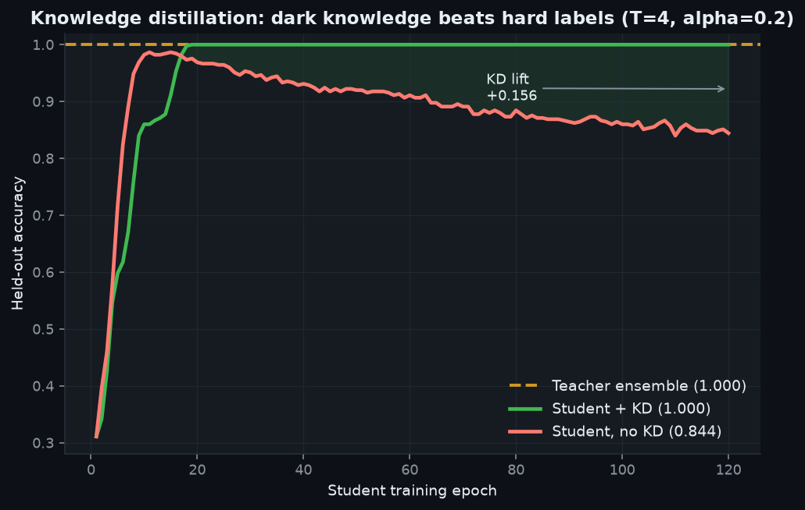
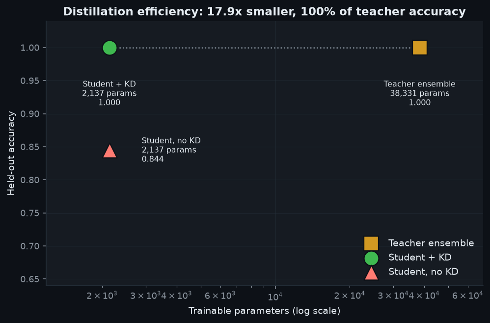
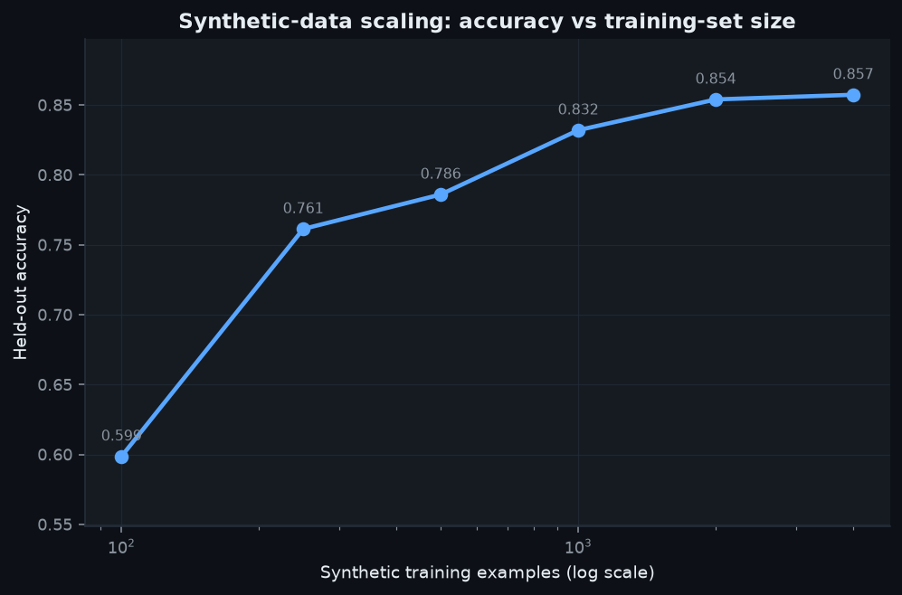
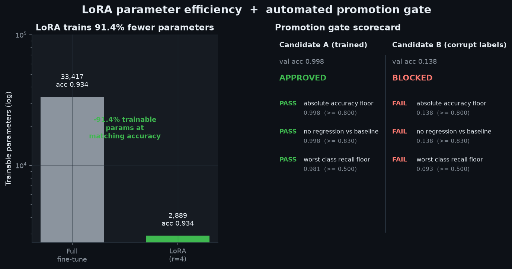

# LLM Fine-Tuning & Distillation Pipeline

A fully-runnable, **GPU-free** pipeline that implements the core techniques used to
adapt and compress large language models — **full fine-tuning**, **LoRA** low-rank
adaptation, **knowledge distillation**, an automated **eval/promotion gate**, and a
**synthetic-data scaling study** — end to end, deterministically, on a CPU in a few
minutes.

> ### Honest framing: surrogate model, real techniques
> There is no GPU and no real LLM here. Every technique is implemented **for real**
> — real gradients, a real train/eval loop, a real low-rank adapter, a real KD loss
> — but on a small **surrogate model**: a 1-hidden-layer NumPy MLP over hashed
> instruction-text features, trained on a synthetic instruction-tuning dataset.
> **I did not train a 70B model.** The point is that fine-tuning, LoRA, and
> distillation are parameterization/optimization techniques whose correctness and
> trade-offs are *model-agnostic*: give them a weight matrix, a differentiable
> loss, and a training loop and they behave exactly as they do on a transformer.
> [`ARCHITECTURE.md`](./ARCHITECTURE.md) maps every component 1:1 onto the real
> stack (QLoRA + 🤗 Transformers `Trainer` + vLLM), and the last README section
> spells out how to scale it up.

## Headline results

All numbers below are produced by `python scripts/run_pipeline.py` and stored in
[`benchmarks/results.json`](./benchmarks/results.json) / `benchmarks/results.md`.

| Technique | Result |
|---|---|
| **LoRA vs full fine-tune** | Both reach **0.934** on the shifted target domain; LoRA trains **2,889** params vs **33,417** → **91.4% fewer trainable parameters**. Adapter merges exactly (max logit diff `0.0e+00`). |
| **Knowledge distillation** | Teacher ensemble **1.000**; a **17.9× smaller** student recovers **100%** of it (**1.000**) with KD, vs **0.844** without — a **+0.156** lift from dark knowledge alone. |
| **Eval gate** | Good model (val **0.998**) → **APPROVED**; corrupted-label model (val **0.138**) → **BLOCKED**. |
| **Data scaling** | Held-out accuracy climbs **0.599 → 0.857** as training data grows 100 → 4,000 examples. |
| **Data generator** | **23,023 rows/s**, 1,000,000 rows in **43.4 s** at bounded memory (100k-row chunks) → ~**12 h** for 1e9 single-process, embarrassingly parallel. |

## Project Document

- Prepared for **Sai Veda**
- Publishing account: **Nikeshk834**
- Full handoff note: [`PROJECT_DOCUMENT.pdf`](./PROJECT_DOCUMENT.pdf)

## Screenshots

Generated by `make screenshots` from real training runs (`assets/`).

### Knowledge distillation: dark knowledge beats hard labels
The no-KD student overfits the noisy transfer labels and decays to 0.844; the
same-size KD student follows the teacher's clean soft targets and tracks 1.000.



### Distillation efficiency (parameters vs accuracy)
A 17.9× smaller student sits on the teacher's accuracy at a fraction of the params.



### Synthetic-data scaling


### LoRA parameter efficiency + promotion-gate scorecard


## Quickstart

```bash
# everything is offline; deps are the standard portfolio stack
make run          # train base/LoRA/teacher/student + gate -> benchmarks/results.json
make screenshots  # render the 4 PNGs into assets/
make test         # pytest suite with real assertions
make bench        # bounded-memory data-generator scaling benchmark
make data         # materialize synthetic splits to data/*.parquet
```

Or directly:

```bash
python scripts/run_pipeline.py --fast     # quicker, smaller configuration
python scripts/make_screenshots.py --run  # run + render in one step
```

## What's actually implemented

| Module | What it does |
|---|---|
| `distillkit/data.py` | Streaming synthetic **instruction dataset**: 3 task families (sentiment / topic / intent) over a 9-way label head, with **disjoint source/target vocabularies** for a real domain shift, distractors, and optional label noise. Chunked generator → bounded memory at any scale. |
| `distillkit/features.py` | Stateless **hashing-trick** featurizer (signed, `blake2b`, `PYTHONHASHSEED`-independent) — the embedding surrogate. |
| `distillkit/model.py` | From-scratch **MLP classifier** with explicit forward/backward and a mini-batch **Adam** loop. A pluggable output-gradient hook lets KD reuse the identical loop. |
| `distillkit/lora.py` | **LoRA adapter** `W1_eff = W1 + (α/r)·B·A`: freeze the base, train `A,B` + head, standard zero-init merge, and exact `merge()` back to a plain model. |
| `distillkit/distill.py` | **Teacher ensemble** (bagged MLPs) + temperature **KD loss** `α·CE + (1−α)·T²·KL` with per-example soft targets. |
| `distillkit/gate.py` | **Promotion gate**: absolute-accuracy floor, no-regression-vs-baseline, worst-class-recall floor → structured verdict for CI. |
| `distillkit/experiments.py` | The four experiment drivers (shared by scripts **and** tests). |

## Tests

`make test` runs a real assertion suite (not smoke tests). The load-bearing ones:

- **LoRA trains far fewer params yet matches full fine-tuning** and clears the
  target accuracy (`test_lora.py`).
- **Adapter merges exactly** — merged logits equal adapter logits to `<1e-9`, and
  the frozen base weights are provably untouched after adapter training.
- **KD student beats the same-size no-KD student** and recovers >90% of the
  teacher (`test_distill.py`).
- **The eval gate blocks a deliberately-bad (corrupted-label) model** and approves
  a good one (`test_gate.py`).
- Data generator balance, disjoint vocab, bounded-memory streaming, and
  more-data-helps monotonicity.

## Reproducibility

Every RNG is seeded, the featurizer hash is process-independent, and
`MPLBACKEND=Agg`. Re-running `make run` reproduces the same numbers. Sizes are
tuned for a few-minute end-to-end run on the sandbox's single-core OpenBLAS
(~1 GFLOP/s); the code is plain BLAS matmuls, so larger `D`/`H`/data only change
wall-clock.

## Scaling to real LLMs (QLoRA · HF Trainer · vLLM)

The techniques port directly; only the "model" and "featurizer" boxes change.

- **LoRA / QLoRA.** Replace `W1` with a transformer's `q/k/v/o` and MLP
  projections. Keep base weights frozen (4-bit NF4 quantized for **QLoRA**), train
  `A`/`B` per target module — same zero-init, same `α/r` scaling, same
  merge-for-inference implemented here. In practice: 🤗 **PEFT** `LoraConfig` +
  **Transformers** `Trainer` (or `SFTTrainer`) with `bitsandbytes` 4-bit loading.
  The 91% trainable-parameter reduction shown here is the same mechanism that lets
  a 7B–70B model be fine-tuned on a single consumer/data-center GPU.
- **Knowledge distillation.** Teacher = a larger checkpoint or an ensemble; student
  = a smaller architecture; identical temperature KD loss on the logits.
  Precompute and cache teacher logits over the transfer set to keep the student
  loop cheap (exactly the `soft_targets` step here).
- **Serving.** `merge()` the adapter and serve the single dense model with **vLLM**
  or **TGI** for high-throughput, paged-attention inference — no adapter overhead
  at runtime.
- **Eval gate in CI.** Wire `gate.py`'s verdict into GitHub Actions so a regression
  or an under-trained checkpoint blocks promotion automatically, with the same
  scorecard shown above.

See [`ARCHITECTURE.md`](./ARCHITECTURE.md) for the full design, trade-offs, and the
component-by-component mapping table.

## Layout

```
08-llm-finetuning-distillation/
├── README.md              ├── ARCHITECTURE.md      ├── Makefile
├── requirements.txt       ├── conftest.py          ├── .gitignore
├── src/distillkit/        # data, features, model, lora, distill, gate, experiments, optim, metrics, viztheme
├── tests/                 # test_data / test_features_model / test_lora / test_distill / test_gate / test_scaling
├── scripts/               # generate_data · run_pipeline · benchmark_generator · make_screenshots
├── benchmarks/            # results.json/md, lora.csv, scaling.csv, generator_throughput.csv
├── assets/                # 4 generated PNGs
└── data/                  # generated parquet (gitignored)
```
